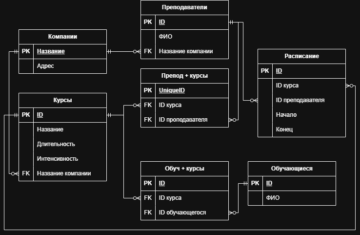

  

<h1 align="center">Учебный центр   Кашкин Роман 328</h1>

  Ниже представлена концептуальная модель пользовательского интерфейса

[Старый вариант README с идеей ролей](README_old.md)
 
 
Навигация по документации: 
- [Роль пользователя](#роль-пользователя)
- [Поддерживаемые операции](#поддерживаемые-операции)
- [Схема навигации между страницами приложения](#схема-навигации-между-страницами-приложения)
- [Описание страниц](#описание-страниц)
- [База банных](#создание-базы-данных-приложения)
- [Схема БД](#схема-бд)
- [Отображение БД на UI](#Отображение-данных-БД-на-страницы-UI)
- [Создание / инициализация БД](#создание-и-инициализация)
## Перечень страниц приложения
- [Главная страница](#1-главная-страница)
- [Курсы (список)](#2-курсы-список)
- [Курс (карточка курса)](#3-курс-карточка-курса)
- [Преподаватели (список)](#4-преподаватели-список)
- [Преподаватель (карточка преподавателя)](#5-преподаватель-карточка-преподавателя)
- [Обучающиеся (список)](#6-обучающиеся-список)
- [Обучающийся (карточка обучающегося)](#7-обучающийся-карточка-обучающегося)
- [Расписание обучающегося](#8-расписание-обучающегося-по-интервалу)
- [Расписание преподавателя](#9-расписание-преподавателя-по-интервалу)

Добавление и редактирование объектов осуществляется на отдельных страницах ввода данных.
## Схема навигации между страницами приложения

## Описание страниц
### 1) Главная страница
**Данные на странице:**  
Пункты меню: Курсы, Преподаватели, Обучающиеся    
**Действия:**  
Переход в соответствующие разделы

### 2) Курсы (список)
**Данные на странице:**  
Таблица курсов: Название курса, длительность/интенсивность, поиск/фильтр по названию    
**Действия:**   
Добавить курс, Открыть карточку курса

### 3) Курс (карточка курса)
**Данные на странице:**  
Данные курса: Название, длительность, интенсивность  
Блок слушатели курса: список обучающихся, записанных на курс (ФИО)  
Блок преподаватели курса  
Блок/форма Расписание курса (результат составления расписания)    
**Действия:**   
Редактировать курс / Сохранить, Удалить курс, Занести обучающегося в список слушателей курса (выбор обучающегося), Получить список обучающихся по курсу (просмотр блока слушателей), Составить расписание занятий для курса (ввод параметров/создание занятий)

### 4) Преподаватели (список)
**Данные на странице:**  
Таблица преподавателей: ФИО, проводимые курсы, Фильтр “по курсу” (для операции “получение списка преподавателей по проводимым курсам”)    
**Действия:**   
Добавить преподавателя  
Открыть Карточку преподавателя  
Удалить преподавателя  
Получить список преподавателей по проводимым курсам (через фильтр/выбор курса)

### 5) Преподаватель (карточка преподавателя)
**Данные на странице:**  
Данные преподавателя: ФИО, проводимые курсы    
**Действия:**  
Редактировать преподавателя / Сохранить  
Удалить преподавателя 

### 6) Обучающиеся (список)
**Данные на странице:**  
Таблица обучающихся: ФИО, поиск по ФИО    
**Действия:**   
Добавить обучающегося  
Открыть Карточку обучающегося   
Удалить обучающегося

### 7) Обучающийся (карточка обучающегося)
**Данные на странице:**  
Данные обучающегося: ФИО  
Блок История обучения: список курсов, текущие курсы     
**Действия:**   
Редактировать обучающегося / Сохранить  
Удалить обучающегося  
Получить историю обучения для данного человека 

### 8) Расписание обучающегося (по интервалу)
**Данные на странице:**  
Интервал дат: дата_от, дата_до  
Результат: список/таблица занятий (дата, время, курс)    
**Действия:**   
Получить расписание на заданный интервал времени для обучающегося

### 9) Расписание преподавателя (по интервалу)
**Данные на странице:**  
Интервал дат: дата_от, дата_до  
Результат: список/таблица занятий (дата, время, курс)    
**Действия:**   
Получить расписание на заданный интервал времени для преподавателя
 
 
## Роль пользователя
Пользователь системы (оператор учебного центра)

## Поддерживаемые операции

### Работа со списками
* Получение списков обучающихся по курсам
  (главная - курсы - нужный курс - список обучающихся)
* Получение истории обучения для данного человека
  (главная - обучающиеся - нужный человек - история обучения)
* Получение списков преподавателей, в том числе по проводимым курсам
  (главная - преподаватели - фильтрация - нужный список)
* Получение расписания на заданный интервал времени для обучающегося
  (главная - обучающиеся - нужный человек - выбор интервала - расписание)
* Получение расписания на заданный интервал времени для преподавателя
  (главная - преподаватели - нужный человек - выбор интервала - расписание)
### Управление расписанием
* Составление расписания занятий для курса
  (главная - курсы - нужный курс - составление расписания)
### Управление обучающимися и преподавателями
* Добавление обучающегося
  (главная - обучающиеся - добавление обучающегося)
* Удаление обучающегося
  (главная - обучающиеся - нужный человек - удаление)
* Чтение данных обучающегося
  (главная - обучающиеся - нужный человек)
* Редактирование данных обучающегося
  (главная - обучающиеся - нужный человек - редактирование данных)
* Занесение обучающегося в список слушателей курса
  (главная - курсы - нужный курс - редактирование списка слушателей)
* Добавление преподавателя
  (главная - преподаватели - добавление преподавателя)
* Удаление преподавателя
  (главная - преподаватели - нужный человек - удаление)
* Чтение данных преподавателя
  (главная - преподаватели - нужный человек)
* Редактирование данных преподавателя
  (главная - преподаватели - нужный человек - редактирование данных)
### Управление курсами
* Добавление курса
  (главная - курсы - добавление курса)
* Удаление курса
  (главная - курсы - нужный курс - удаление)
* Чтение данных курса
  (главная - курсы - нужный курс)
* Редактирование данных курса
  (главная - курсы - нужный курс - редактирование данных)

# Создание Базы данных приложения
## Схема БД

## Отображение данных БД на страницы UI
### 1) Главная
Ничего

### 2) Курсы (список)
**Данные:**  
курс (название, длительность, интенсивность), компания (название)  
**Таблицы:**  
курсы (+ компании по FK)

### 3) Курс (карточка курса)
**Данные:**  
курс: из таблицы курсы  
преподаватели курса: Преподаватели через Препод + Курсы  
слушатели курса: обучающиеся через Обуч + Курсы  
расписание курса: расписание  
**Таблицы:**  
курсы, Препод + Курсы, Преподаватели, Обуч + Курсы, Обучающиеся, Расписание

### 4) Обучающиеся (список)
**Данные:**  
ФИО   
**Таблицы:**  
Обучающиеся

### 5) Обучающийся (карточка)

**Данные:**
ученик: Обучающиеся  
история обучения: курсы через Обуч + Курсы  
**Таблицы:**  
Обучающиеся, Обуч + курсы, курсы

### 6) Преподаватели (список)
**Данные:**  
ФИО, Компания  
**Таблицы:**  
Переподаватели, компании

### 7) Преподаватель (карточка)
**Данные:**  
Преподаватели, компания, курсы  
**Таблицы:**  
Преподаватели, Компании, Препод + курсы, курсы

### 8) Расписание обучающегося (по интервалу)
**Данные:**  
занятия по курсам, где ученик записан  
**Таблицы:**  
расписание, обуч + курсы, курсы, преподаватель

### 9) Расписание преподавателя (по интервалу)
**Данные:**  
занятия преподавателя  
**Таблицы:**  
расписание, курсы

## Создание и инициализация
[Скрипт создания БД](Java_Roma.sql)  
[Скрипт заполнения БД](Java_Roma_2.sql)
