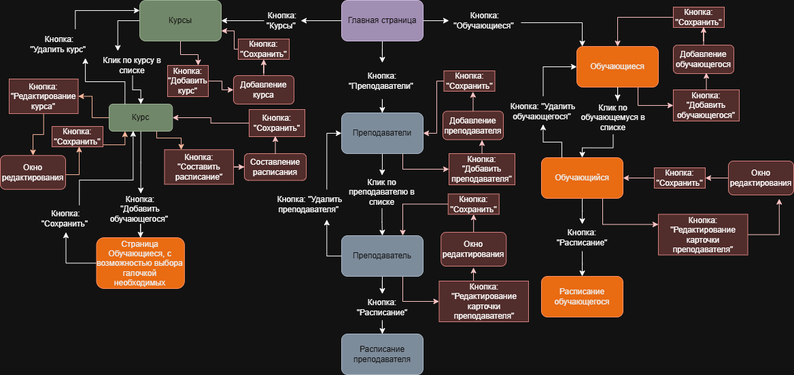
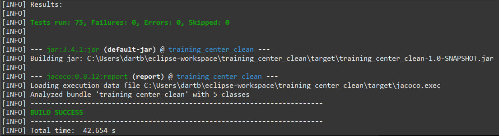

  

<h1 align="center">Учебный центр   Кашкин Роман 328</h1>

  Ниже представлена концептуальная модель пользовательского интерфейса

[Старый вариант README с идеей ролей](README_old.md)
 
 
Навигация по документации: 
- [Роль пользователя](#роль-пользователя)
- [Поддерживаемые операции](#поддерживаемые-операции)
- [Схема навигации между страницами приложения](#схема-навигации-между-страницами-приложения)
- [Описание страниц](#описание-страниц)
- [База банных](#создание-базы-данных-приложения)
- [Схема БД](#схема-бд)
- [Отображение БД на UI](#Отображение-данных-БД-на-страницы-UI)
- [Создание / инициализация БД](#создание-и-инициализация)
- [Второй этап](#второй-этап)
- [Отчет о прокрытии тестами](#Отчет-о-покрытии)
## Перечень страниц приложения
- [Главная страница](#1-главная-страница)
- [Курсы (список)](#2-курсы-список)
- [Курс (карточка курса)](#3-курс-карточка-курса)
- [Преподаватели (список)](#4-преподаватели-список)
- [Преподаватель (карточка преподавателя)](#5-преподаватель-карточка-преподавателя)
- [Обучающиеся (список)](#6-обучающиеся-список)
- [Обучающийся (карточка обучающегося)](#7-обучающийся-карточка-обучающегося)
- [Расписание обучающегося](#8-расписание-обучающегося-по-интервалу)
- [Расписание преподавателя](#9-расписание-преподавателя-по-интервалу)

Добавление и редактирование объектов осуществляется в отдельных окнах ввода данных.
## Схема навигации между страницами приложения
  
  
Внесены изменения в схему навигации после уточняющего вопроса в конце лекции по ПИ, добавлены более полные описания действий с окнами в рамках каждой страницы.

## Описание страниц
### 1) Главная страница
**Данные на странице:**  
Пункты меню: Курсы, Преподаватели, Обучающиеся    
**Действия:**  
Переход в соответствующие разделы

### 2) Курсы (список)
**Данные на странице:**  
Таблица курсов: Название курса, длительность/интенсивность, поиск/фильтр по названию    
**Действия:**   
Добавить курс, Открыть карточку курса

### 3) Курс (карточка курса)
**Данные на странице:**  
Данные курса: Название, длительность, интенсивность  
Блок слушатели курса: список обучающихся, записанных на курс (ФИО)  
Блок преподаватели курса  
Блок/форма Расписание курса (результат составления расписания)    
**Действия:**   
Редактировать курс / Сохранить, Удалить курс, Занести обучающегося в список слушателей курса (выбор обучающегося), Получить список обучающихся по курсу (просмотр блока слушателей), Составить расписание занятий для курса (ввод параметров/создание занятий)

### 4) Преподаватели (список)
**Данные на странице:**  
Таблица преподавателей: ФИО, проводимые курсы, Фильтр “по курсу” (для операции “получение списка преподавателей по проводимым курсам”)    
**Действия:**   
Добавить преподавателя  
Открыть Карточку преподавателя  
Получить список преподавателей по проводимым курсам (через фильтр/выбор курса)

### 5) Преподаватель (карточка преподавателя)
**Данные на странице:**  
Данные преподавателя: ФИО, проводимые курсы    
**Действия:**  
Редактировать преподавателя / Сохранить  
Удалить преподавателя 

### 6) Обучающиеся (список)
**Данные на странице:**  
Таблица обучающихся: ФИО, поиск по ФИО    
**Действия:**   
Добавить обучающегося  
Открыть Карточку обучающегося   

### 7) Обучающийся (карточка обучающегося)
**Данные на странице:**  
Данные обучающегося: ФИО  
Блок История обучения: список курсов, текущие курсы     
**Действия:**   
Редактировать обучающегося / Сохранить  
Удалить обучающегося  
Получить историю обучения для данного человека 

### 8) Расписание обучающегося (по интервалу)
**Данные на странице:**  
Интервал дат: дата_от, дата_до  
Результат: список/таблица занятий (дата, время, курс)    
**Действия:**   
Получить расписание на заданный интервал времени для обучающегося

### 9) Расписание преподавателя (по интервалу)
**Данные на странице:**  
Интервал дат: дата_от, дата_до  
Результат: список/таблица занятий (дата, время, курс)    
**Действия:**   
Получить расписание на заданный интервал времени для преподавателя
 
 
## Роль пользователя
Пользователь системы (оператор учебного центра)

## Поддерживаемые операции

### Работа со списками
* Получение списков обучающихся по курсам
  (главная - курсы - нужный курс - список обучающихся)
* Получение истории обучения для данного человека
  (главная - обучающиеся - нужный человек - история обучения)
* Получение списков преподавателей, в том числе по проводимым курсам
  (главная - преподаватели - фильтрация - нужный список)
* Получение расписания на заданный интервал времени для обучающегося
  (главная - обучающиеся - нужный человек - выбор интервала - расписание)
* Получение расписания на заданный интервал времени для преподавателя
  (главная - преподаватели - нужный человек - выбор интервала - расписание)  

  
### Управление расписанием
* Составление расписания занятий для курса  
  Cоздание расписания занятий выбранного курса с указанием преподавателя, даты и времени проведения занятий.  
  #### Условия
  - курс создан в системе;
  - в системе существует хотя бы один преподаватель;
  - преподаватель назначен на курс.
  #### Шаги:
  1. Пользователь переходит на **Главную страницу**.
  2. В главном меню выбирает раздел **Курсы**.
  3. На странице **Курсы (список)** пользователь выбирает необходимый курс
из таблицы курсов.
  4. На странице **Курс (карточка курса)** пользователь нажимает кнопку: "Составить расписание"
  5. Открывается окно ввода параметров занятия.
     Вводимые данные:
     - преподаватель (выбор из преподавателей курса);
     - дата занятия;
     - время начала занятия;
     - время окончания занятия.
  6. Пользователь подтверждает ввод данных: "Сохранить"
  7. Система выполняет проверки:
     - корректность временного интервала (end_at > start_at);
     - курс создан в системе;
     - преподаватель назначен на курс (через связь course_teachers);
  8. создаётся запись в таблице: schedule
  9. Новое занятие отображается в блоке: Расписание курса
### Управление обучающимися и преподавателями
* Добавление обучающегося
  (главная - обучающиеся - добавление обучающегося)
* Удаление обучающегося
  (главная - обучающиеся - нужный человек - удаление)
* Чтение данных обучающегося
  (главная - обучающиеся - нужный человек)
* Редактирование данных обучающегося
  (главная - обучающиеся - нужный человек - редактирование данных)
* Занесение обучающегося в список слушателей курса
  (главная - курсы - нужный курс - редактирование списка слушателей)
* Добавление преподавателя
  (главная - преподаватели - добавление преподавателя)
* Удаление преподавателя
  (главная - преподаватели - нужный человек - удаление)
* Чтение данных преподавателя
  (главная - преподаватели - нужный человек)
* Редактирование данных преподавателя
  (главная - преподаватели - нужный человек - редактирование данных)
### Управление курсами
* Добавление курса
  (главная - курсы - добавление курса)
* Удаление курса
  (главная - курсы - нужный курс - удаление)
* Чтение данных курса
  (главная - курсы - нужный курс)
* Редактирование данных курса
  (главная - курсы - нужный курс - редактирование данных)

# Создание Базы данных приложения
## Схема БД

## Отображение данных БД на страницы UI
### 1) Главная
Ничего

### 2) Курсы (список)
**Данные:**  
курс (название, длительность, интенсивность), компания (название)  
**Таблицы:**  
курсы (+ компании по FK)

### 3) Курс (карточка курса)
**Данные:**  
курс: из таблицы курсы  
преподаватели курса: Преподаватели через Препод + Курсы  
слушатели курса: обучающиеся через Обуч + Курсы  
расписание курса: расписание  
**Таблицы:**  
курсы, Препод + Курсы, Преподаватели, Обуч + Курсы, Обучающиеся, Расписание

### 4) Обучающиеся (список)
**Данные:**  
ФИО   
**Таблицы:**  
Обучающиеся

### 5) Обучающийся (карточка)

**Данные:**
ученик: Обучающиеся  
история обучения: курсы через Обуч + Курсы  
**Таблицы:**  
Обучающиеся, Обуч + курсы, курсы

### 6) Преподаватели (список)
**Данные:**  
ФИО, Компания  
**Таблицы:**  
Переподаватели, компании

### 7) Преподаватель (карточка)
**Данные:**  
Преподаватели, компания, курсы  
**Таблицы:**  
Преподаватели, Компании, Препод + курсы, курсы

### 8) Расписание обучающегося (по интервалу)
**Данные:**  
занятия по курсам, где ученик записан  
**Таблицы:**  
расписание, обуч + курсы, курсы, преподаватель

### 9) Расписание преподавателя (по интервалу)
**Данные:**  
занятия преподавателя  
**Таблицы:**  
расписание, курсы

## Создание и инициализация
[Скрипт создания БД](Java_Roma.sql)  
[Скрипт заполнения БД](Java_Roma_2.sql)

# Второй этап
- созданы классы хранимых объектов;
- настроено отображение БД на объекты через Hibernate;
- создан конфигурационный файл `hibernate.cfg.xml`;
- реализован служебный класс `HibernateUtil`;
- проект переведен на Spring
- реализованы DAO-классы
- разработаны модульные тесты
## Результаты выполнения тестов:

## Отчет о покрытии:
[Открыть HTML-отчет](https://dartberror.github.io/wtpractice/)       
см. папку training_center_clean

## Сценарии системного тестирования
### Что покрывают системные тесты
- Навигация и открытие основных страниц.
- Сценарии CRUD и валидации для организаций.
- Сценарии CRUD и валидации для обучающихся.
- Сценарии CRUD и валидации для преподавателей.
- Сценарии CRUD и валидации для курсов.
- Назначение и удаление обучающихся/преподавателей в курсе.
- Успешное создание занятия и проверки валидации.
- Расписание обучающегося/преподавателя для корректного и некорректного интервала.

## Предусловия
- Приложение развернуто и доступно по адресу `http://localhost:8080/training_center_clean`.
- База данных инициализирована схемой и тестовыми данными.
- Установлен браузер Chrome или Edge.
- Selenium-тесты запускаются через Maven: `mvn -Dtest=training_center.system.WebSystemTest test`.

## Сценарии, покрытые Selenium

1. Открытие главной страницы и проверка основных ссылок навигации.  
Ожидаемый результат: видны ссылки на курсы, преподавателей, обучающихся и организации.

2. Успешное создание организации при корректных данных.  
Ожидаемый результат: переход на список организаций и отображение новой записи.

3. Ошибка при создании организации без названия.  
Ожидаемый результат: форма остается открытой и показывается сообщение об ошибке.

4. Ошибка при создании организации без адреса.  
Ожидаемый результат: форма остается открытой и показывается сообщение об ошибке.

5. Успешное создание обучающегося при корректных данных.  
Ожидаемый результат: переход на список обучающихся и отображение новой записи.

6. Ошибка при создании обучающегося без ФИО.  
Ожидаемый результат: форма остается открытой и показывается сообщение об ошибке.

7. Успешное редактирование обучающегося.  
Ожидаемый результат: переход в карточку обучающегося и отображение обновленного ФИО.

8. Успешное удаление обучающегося.  
Ожидаемый результат: переход на список обучающихся и отсутствие удаленной записи.

9. Успешное создание преподавателя при корректных данных.  
Ожидаемый результат: переход на список преподавателей и отображение новой записи.

10. Ошибка при создании преподавателя без ФИО.  
Ожидаемый результат: форма остается открытой и показывается сообщение об ошибке.

11. Успешное редактирование преподавателя.  
Ожидаемый результат: переход в карточку преподавателя и отображение обновленных данных.

12. Успешное удаление преподавателя.  
Ожидаемый результат: переход на список преподавателей и отсутствие удаленной записи.

13. Успешное создание курса при корректных данных.  
Ожидаемый результат: переход на список курсов и отображение новой записи.

14. Ошибка при создании курса без названия.  
Ожидаемый результат: форма курса остается открытой и показывается сообщение об ошибке.

15. Ошибка при создании курса с некорректной интенсивностью.  
Ожидаемый результат: форма курса остается открытой и показывается сообщение об ошибке.

16. Ошибка при создании курса с некорректной длительностью.  
Ожидаемый результат: форма курса остается открытой и показывается сообщение об ошибке.

17. Успешное редактирование курса.  
Ожидаемый результат: переход в карточку курса и отображение обновленных значений.

18. Успешное удаление курса.  
Ожидаемый результат: переход на список курсов и отсутствие удаленной записи.

19. Успешное добавление обучающегося в курс.  
Ожидаемый результат: переход в карточку курса и отображение обучающегося в блоке участников.

20. Успешное назначение преподавателя на курс.  
Ожидаемый результат: переход в карточку курса и отображение преподавателя в блоке преподавателей.

21. Успешное удаление обучающегося из курса.  
Ожидаемый результат: переход в карточку курса и отсутствие обучающегося в списке.

22. Успешное удаление преподавателя из курса.  
Ожидаемый результат: переход в карточку курса и отсутствие преподавателя в списке.

23. Успешное создание занятия при корректном интервале времени.  
Ожидаемый результат: переход в карточку курса и появление занятия в расписании.

24. Ошибка при создании занятия, если время окончания раньше времени начала.  
Ожидаемый результат: форма занятия остается открытой и показывается сообщение об ошибке.

25. Успешное получение расписания обучающегося за корректный интервал.  
Ожидаемый результат: в расписании отображаются курс и преподаватель созданного занятия.

26. Успешное получение расписания преподавателя за корректный интервал.  
Ожидаемый результат: в расписании отображается курс созданного занятия.

27. Ошибка при запросе расписания обучающегося, если задана только одна граница интервала.  
Ожидаемый результат: показывается сообщение о некорректном интервале.

28. Ошибка при запросе расписания преподавателя, если задана только одна граница интервала.  
Ожидаемый результат: показывается сообщение о некорректном интервале.

- Если приложение не запущено или WebDriver не инициализируется, системные тесты автоматически пропускаются.

## Руководство по запуску
### Локальный запуск
1. Подготовьте базу данных.
- Создайте схему и заполните данными через SQL-скрипты (`Java_Roma.sql`, `Java_Roma_2.sql`).
- Проверьте, что PostgreSQL доступен с настройками проекта.

2. Запустите веб-приложение.
- Разверните приложение в Tomcat.
- Убедитесь, что приложение открывается по адресу:
`http://localhost:8080/training_center_clean`

3. Запустите тесты.
- Полный набор тестов:
`mvn test`
- Только Selenium-системные тесты:
`mvn -Dtest=training_center.system.WebSystemTest test`

4. Откройте отчет по тестам.
- `target/surefire-reports/index.html`

### Сборка WAR
- Собрать WAR:
`mvn clean package`
- Результат:
`target/training_center_clean.war`

### Сборка и деплой через Ant
Файл сборки: `build.xml`

Основной target:
- `full-build-and-deploy`

Запуск:
- `ant -f build.xml full-build-and-deploy`

Папка деплоя по умолчанию в `build.xml`:
- `C:/tomcat/wtpwebapps`

Если нужно переопределить параметры:
- `ant -f build.xml -Dmaven.cmd=C:/path/to/mvn.cmd -Dtomcat.deploy.dir=C:/tomcat/wtpwebapps full-build-and-deploy`

### Быстрый сценарий воспроизведения
1. Открыть проект.
2. Инициализировать БД SQL-скриптами.
3. Запустить Tomcat и развернуть приложение.
4. Выполнить `mvn test`.
5. Открыть `target/surefire-reports/index.html`.
6. Выполнить `ant -f build.xml full-build-and-deploy`.

